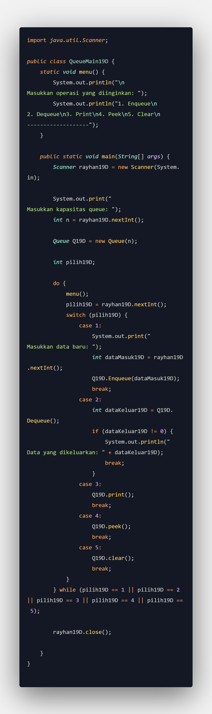

# Laporan Praktikum 10

NIM : 2241720213 
Nama : Muhammad Rayhan 
Kelas : TI-1D

## <b>Latihan</b>

### <b>10.1 Queue 1</b>

1. Pembuatan Program 
   <strong>Queue</strong> 
     
   <strong>QueueMain</strong>
    

2. Verifikasi Hasil Percobaan
    

3. Jawaban 
   1. Hal ini dilakukan untuk membedakan mana antrean kosong dengan mana antrean dengan satu elemen yang dimulai dari indeks 0, mengingat array di Java selalu dimulai dari 0.
   2. Hal itu dilakukan untuk mengatur kembali variabel belakang ke indeks awal pada array jika variabel belakang telah mencapai nilai maks-1. Oleh karena itu, penambahan elemen baru dapat dilakukan dari indeks awal agar urutan antrean tetap terjaga.
   3. q19D[belakang19D] = data;
   4. data = q19D[depan19D];
   5. Hal itu digunakan untuk menentukan apakah elemen yang dikeluarkan dari antrean merupakan elemen terakhir di dalam array (posisi indeks maksimum).
   6. karena nilai depan19D menunjukkan indeks elemen pertama (posisi paling depan) dalam antrean yang harus dicetak terlebih dahulu, dan nilai depan tidak selalu dimulai dari 0.
   7. Hal ini digunakan untuk menginkremenkan variabel i dan memastikan bahwa nilai variabel i tidak melampaui batas maksimum antrean (maks19D).

### <b>10.2 Queue 2</b>

1. Pembuatan Program 
   <strong>Penumpang</strong> 
     
   <strong>QueueMain</strong>
    

2. Verifikasi Hasil Percobaan
    
     

3. Jawaban
   1. Untuk menginisialisasi nilai-nilai atribut dalam konstruktor tersebut dengan nilai yang belum ada atau kosong.
   2. Hal yang terjadi adalah eror karena kode tersebut tidak sesuai dengan isian konstruktor yang membutuhkan parameter untuk diinputkan.
   3. if (!IsEmpty()) {
      depan19D = belakang19D = -1;
      ukuran19D = 0;
      System.out.println("Queue berhasil dikosongkan"); }
   4. Modifikasi kode program 
       
        

## <b>Tugas</b>

1.  
     
   
2. 
