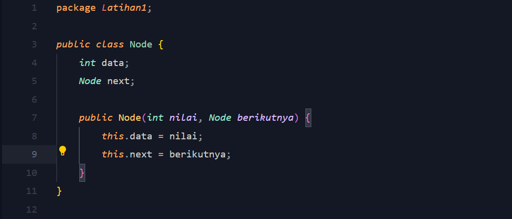
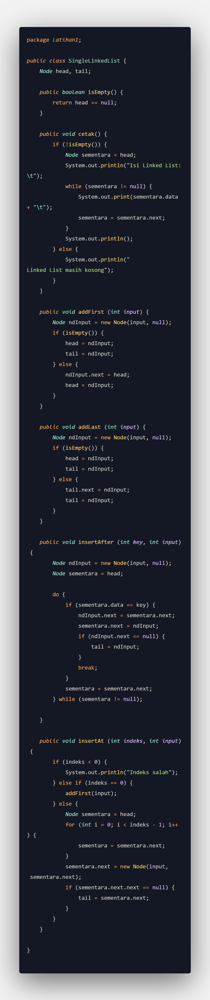
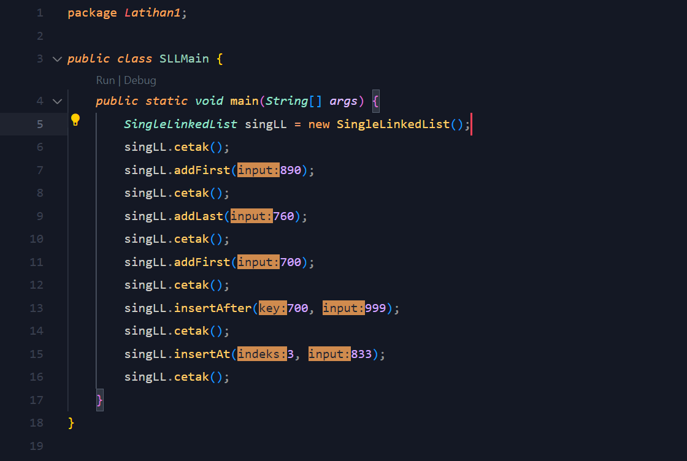
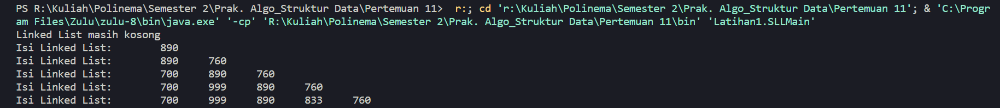
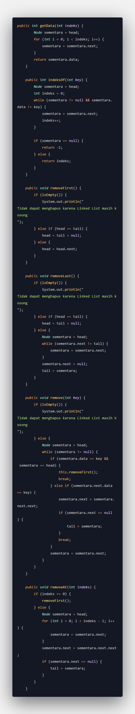
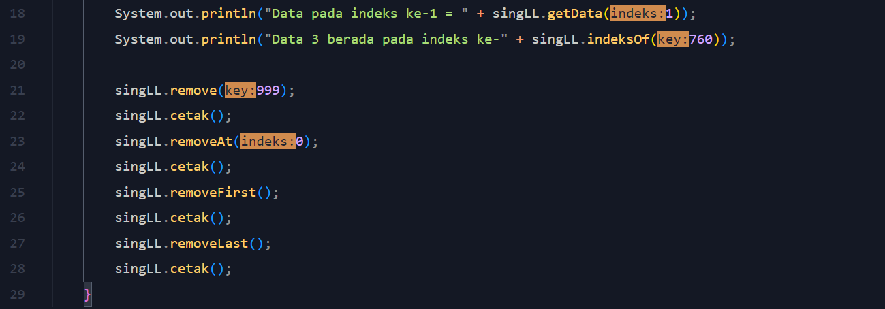
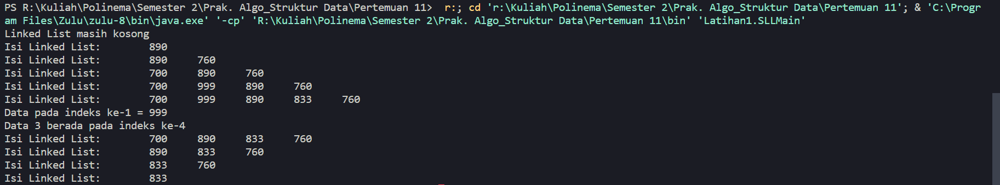

# Laporan Praktikum 10

NIM : 2241720213 
Nama : Muhammad Rayhan 
Kelas : TI-1D

## <b>Latihan</b>

### <b>11.1 Pembuatan Single Linked List</b>

1. Pembuatan Program 
   <strong>Node.java</strong> 
     
   <strong>Single Lingked List</strong>
    
   <strong>SLL Main</strong>
    

2. Verifikasi Hasil Percobaan
    

3. Jawaban 
   1. Hasil compile "Linked List Kosong" muncul karena pada kondisi tersebut, method `isEmpty()` mengembalikan nilai `true`, yang berarti variabel `head` dalam objek `SingleLinkedList` masih kosong (bernilai `null`). Kondisi ini menunjukkan bahwa belum ada simpul atau elemen yang ditambahkan ke dalam linked list. Oleh karena itu, ketika method `cetak()` dijalankan, maka output yang muncul adalah "Linked List masih kosong".
   2. Kode `ndInput.next = sementara.next` berfungsi untuk mengatur node berikutnya dari node yang baru diinput (`ndInput`) agar menunjuk ke node setelah node yang menjadi kunci pencarian (`sementara`), sehingga node yang baru bisa dimasukkan setelah node yang menjadi kunci tersebut. 
Kode `sementara.next = ndInput` berfungsi untuk mengatur node berikutnya dari node yang menjadi kunci pencarian (`sementara`) agar menunjuk ke node yang baru diinput (`ndInput`), sehingga node yang baru diinput menjadi terhubung ke dalam linked list.
   3. Kode di atas pada metode insertAt digunakan untuk memperbarui referensi tail (ekor) dari linked list jika elemen baru yang dimasukkan ke dalam linked list ditempatkan pada posisi terakhir atau setelah elemen terakhir yang sudah ada. Jika sementara.next.next (artinya elemen setelah elemen yang sedang dipertimbangkan) bernilai null, itu berarti bahwa elemen yang sedang dipertimbangkan saat ini adalah elemen terakhir dalam linked list. Dalam hal ini, tail diatur untuk merujuk pada elemen terakhir (yaitu elemen yang baru ditambahkan). Dengan cara ini, kita dapat mempercepat operasi yang melibatkan akses ke elemen terakhir dalam linked list.

### <b>11.2 Modifikasi Elemen pada Single Linked List</b>

1. Pembuatan Program 
   <strong>Single Linked List</strong> 
     
   <strong>SLLMain</strong>
    

2. Verifikasi Hasil Percobaan
     

3. Jawaban
   1. Keyword `break` pada metode `remove` digunakan untuk menghentikan loop ketika node yang dihapus telah ditemukan dan dihapus dari linked list. Setelah node dihapus, tidak perlu lagi mencari node yang ingin dihapus karena node tersebut sudah dihapus. Oleh karena itu, loop dapat dihentikan menggunakan keyword `break` agar tidak membuang waktu untuk mencari node yang sama lagi. Jika `break` tidak digunakan, loop akan terus berjalan hingga mencapai akhir linked list meskipun node yang ingin dihapus sudah ditemukan dan dihapus. Hal ini akan memakan waktu ekstra dan memperlambat kinerja program.
   2. Kode di atas pada metode insertAt digunakan untuk memperbarui referensi tail (ekor) dari linked list jika elemen baru yang dimasukkan ke dalam linked list ditempatkan pada posisi terakhir atau setelah elemen terakhir yang sudah ada. Jika sementara.next.next (artinya elemen setelah elemen yang sedang dipertimbangkan) bernilai null, itu berarti bahwa elemen yang sedang dipertimbangkan saat ini adalah elemen terakhir dalam linked list. Dalam hal ini, tail diatur untuk merujuk pada elemen terakhir (yaitu elemen yang baru ditambahkan). Dengan cara ini, kita dapat mempercepat operasi yang melibatkan akses ke elemen terakhir dalam linked list.
   3. Nilai kembalian method indexOf memiliki dua kemungkinan, yaitu,
      1. Nilai indeks (non-negatif): Ini menunjukkan bahwa elemen dengan nilai yang dicari ditemukan pada indeks tertentu dalam linked list. Indeks ini merupakan indeks dari elemen pertama yang ditemukan dengan nilai yang sesuai.
      2. Nilai -1: Ini menunjukkan bahwa elemen dengan nilai yang dicari tidak ditemukan dalam linked list. Jadi, tidak ada elemen dengan nilai tersebut dalam linked list.
      
      Ketika method indexOf dieksekusi, itu akan melakukan pencarian berulang pada linked list untuk mencari elemen dengan nilai yang sesuai. Jika ditemukan, indeks elemen tersebut akan dikembalikan. Jika tidak ditemukan, nilai -1 akan dikembalikan untuk menandakan bahwa elemen tidak ada dalam linked list.

## <b>Tugas</b>

1. 
