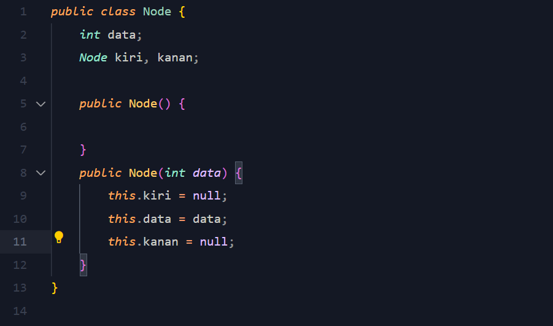
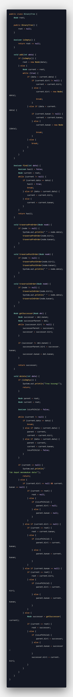
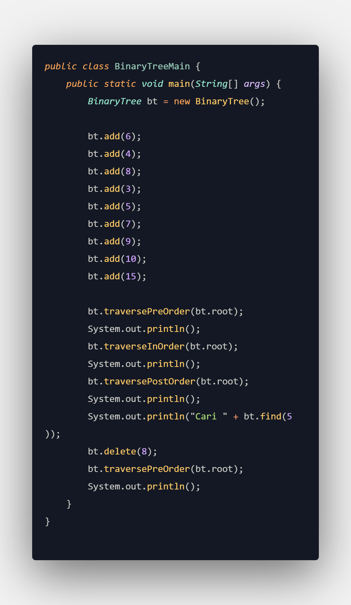
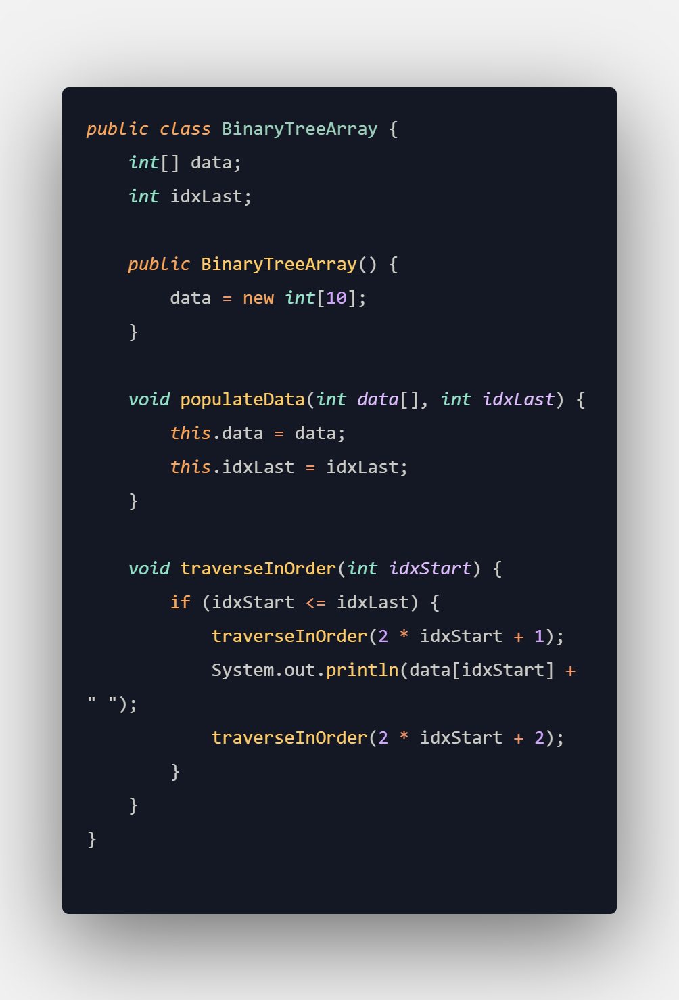
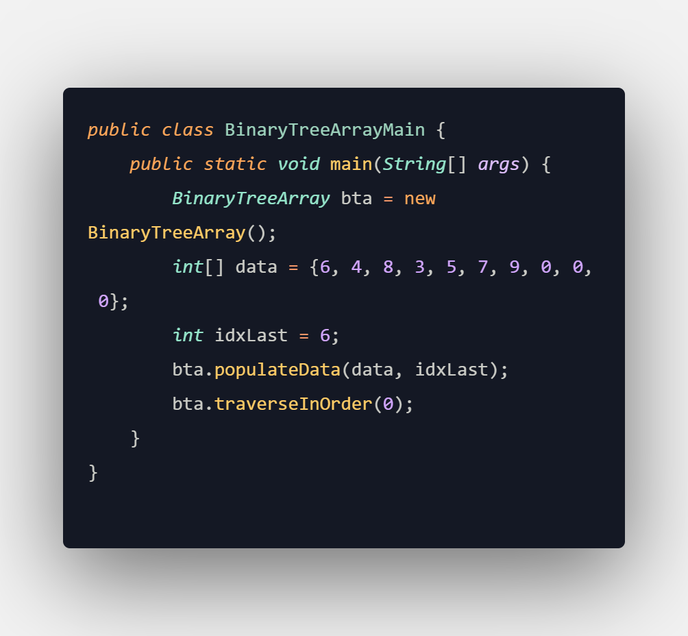

# Laporan Praktikum 10

NIM : 2241720213 
Nama : Muhammad Rayhan 
Kelas : TI-1D

## <b>Latihan</b>

### <b>Binary Tree</b>

1. Pembuatan Program 
   <strong>Node.java</strong> 
     
   <strong>Binary Tree</strong>
    
   <strong>Main</strong>
    

2. Verifikasi Hasil Percobaan
    

3. Jawaban 
   1. Binary search tree (BST) memiliki sifat yang memungkinkan operasi pencarian menjadi lebih efisien dibandingkan dengan binary tree biasa karena dapat menghilangkan setengah dari pohon yang tersisa pada setiap langkah pencarian.
   2. Kegunaan ataribut kanan (right) dan kiri (left) adalah untuk menyimpan referensi node ke sebelah kir untuk kiri atau sebelah kanan untuk kanan.
   3. Root berfungsi menyimpan referensi ke node root (akar) dari binary tree. Saat root pertama kali dideklarasikan, nilainya adalah null.
   4. Saat node masih kosong (null) akan terdapat node baru secara otomatis. Setelah ada node baru ditambahkan, node baru tersebut akan menjadi root dari tree tersebut.
   5. * if (data < current.data) 
   Data baru akan dimasukkan ke baris berikutnya jika data tersebut lebih kecil daripada data pada node current.
* if (current.left != null) {
    current = current.left;
   Kode di atas menyatakan jika terdapat node di sambungan pointer node current sebelah kiri, current akan berpindah di node yang terhubung dengan pointer node current sebelah kiri.
* } else {
    current.left = new Node(data);
    break;
    }   
Selanjutnya, bagian else menyatakan jika tidak ada node di sambungan pointer node current sebelah kiri, node baru ditambahkan sesuai data yang dimasukkan pada parameter.

### <b>Binary Tree Array</b>

1. Pembuatan Program 
   <strong>Binary Tree Array</strong> 
     
   <strong>Main</strong>
    

2. Verifikasi Hasil Percobaan
     

3. Jawaban
   1. Atribut data berfungsi menyimpan data, sementara atribut IdxLast berfungsi menyimpan batas indeks untuk dicetak.
   2. Berfungsi menginputkan nilai awal array dan mengatur batas terakhir indeks array yang akan digunakan pada method traverse in order
   3. Berfungsi mencetak data secara indorder
   4. leftchild berada pada indeks ke-5 dan rightchild berada pada indeks ke-6 jika root dimulai dari indeks ke-0. Sebaliknya, jika root dimulai dari indeks ke-1, leftchild terletak pada indeks ke 5 dan righchild terletak pada indeks ke 6.
   5. Berfungsi untuk membatasi array agar dapat mencetak sampai indeks ke-6 pada saat dicetak pada traverseInOrder.

## <b>Tugas</b>

1.   
2.   
3.   
3.   
