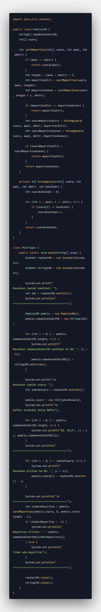

# Laporan Praktikum 3

NIM : 2241720213 
Nama : Muhammad Rayhan 
Kelas : TI-1D

## <b>Latihan</b>

### <b>4.1 Menghitung Nilai Faktorial dengan Algoritma Brute Force dan Divide and Conquer</b>

1. Pembuatan Program
     
2. Verifikasi Hasil Percobaan
     
3. Jawaban 
   1. <i>Base line</i> atau kasus dasar adalah sebuah kondisi yang dapat menghentikan perulangan sebuah proses fungsi rekursi. Pada program di atas, kasus dasar terdapat di baris 23 dan 24 atau bagian kode <b>if (n == 1) {return 1;}</b>.
   2. Program tersebut bukan termasuk yang menggunakan metode divide and conquer karena tidak mencakup semua tahapannya, melainkan hanya ada tahapan conquer saja. Tahapan conquer berada bagian blok kode else yang isinya memanggil dirinya sendiri.
   3. Bisa diubah dengan perulangan while. 
       
       
   4. Program 
       
      Hasil Eksekusi 
       
   5. Hasil eksekusi
       
      Jika melihat dari hasil eksekusi di atas, waktu eksekusi paling cepat adalah yang menggunakan metode divide and conquer. Hal ini bisa terjadi karena metode tersebut memecah masalah menjadi submasalah yang lebih kecil dan independen di awal sehingga mengefisienkan eksekusi. Berbeda dengan metode brute force yang harus mengeksekusi nilai demi nilai dari awal.

### <b>4.2 Menghitung Hasil Pangkat dengan Algoritma Brute Force dan Divide and Conquer</b>

1. Pembuatan Program
     
2. Verifikasi Hasil Percobaan
     
3. Jawaban
   1. Metode PangkatBF:  1. Menggunakan metode brute force  2. Menggunakan perulangan</ul>  
      Metode PangkatDC:  1. Menggunakan metode divide and conquer  2. Menggunakan if else  3. Menggunakan fungsi rekursi  
   2. Potongan kode tersebut berfungsi untuk memecah masalah menjadi submasalah yang lebih kecil dan sederhana. jika nilai n merupakan bilangan ganjil, maka masalah perpangkatan akan dibagi menjadi dua submasalah yang masing-masing mempunyai eksponen n/2, ditambah satu kali operasi perkalian dengan basis a. Proses ini dilakukan secara rekursi dengan memanggil kembali fungsi pangkatDC19D(a, n/2) sebanyak dua kali. Kemudian, nilai kembaliannya akan dikalikan dengan basis a dan dikembalikan sebagai hasil perpangkatan. Begitu pun dengan nilai yang merupakan bilangan genap. Hanya saja, tidak terdapat operasi perkalian dengan basis a pada return-nya.  
   3. Secara eksplisit, tidak ada tahapan combine pada program tersebut karena hasil dari operasi setiap submasalah (dari tahap conquer) dikalikan langsung tanpa ada operasi combine khusus.  
   4. Kode konstruktor
       
      Kode input nilai ke konstruktor
        
   5. Pembuatan Program 
       
      Eksekusi Program 
       
        

### <b>4.3 Menghitung Sum Array dengan Algoritma Brute Force dan Divide and Conquer</b>

1. Pembuatan Program
     
2. Verifikasi Hasil Percobaan
     
3. Jawaban
   1. Metode totalBF() melakukan perhitungan keuntungan dengan cara menjumlah seluruh elemen array satu per satu. Sementara itu, metode totalDC() melakukan perhitungan keuntungan dengan cara memecah masalah menjadi submasalah yang lebih kecil dan sederhana. Metode ini akan membagi array ke dalam dua bagian dan mencari total keuntungan di setiap bagian tersebut secara terpisah. Setelah itu, metode ini akan menjumlahkan total keuntungan di setiap bagian tersebut dan juga nilai keuntungan di tengah array, yaitu pada bulan ke-6. Proses ini akan terus dilakukan secara rekursi hingga elemen array hanya tersisa satu, sehingga dapat dihitung secara langsung.  
   2. Caranya adalah dengan menggunakan print format yang di dalamnya terdapat identifier yang diteruskan dengan titik lalu batas jumlah digit pada koma. Sebagai contoh, %.5f adalah membatas jumlah digit setelah koma sebanyak lima (5).  
   3. Potongan kode tersebut berfungsi sebagai kombinator submasalah-submasalah yang ada, yaitu submasalah kanan, tengah, dan kiri.  
   4. Variable mid pada method totalDC19D() dibutuhkan untuk membagi array input menjadi dua bagian yang seimbang pada setiap rekursi. Dengan begitu, pada setiap rekursi, array input akan terbagi menjadi dua sub-array dengan ukuran yang kurang lebih sama. Dalam proses divide and conquer, penggunaan variable mid ini akan membantu untuk memanggil kembali method totalDC19D() secara rekursif pada sub-array yang lebih kecil. 
   5. Perhitungan banyak perusahaan sekaligus dapat dilakukan dengan cara membuat array of object seperti program di bawah 
      Pembuatan program 
       
      Hasil eksekusi 
        

## Tugas

1.  Pembuatan Program 
      
    Hasil Eksekusi 
    
